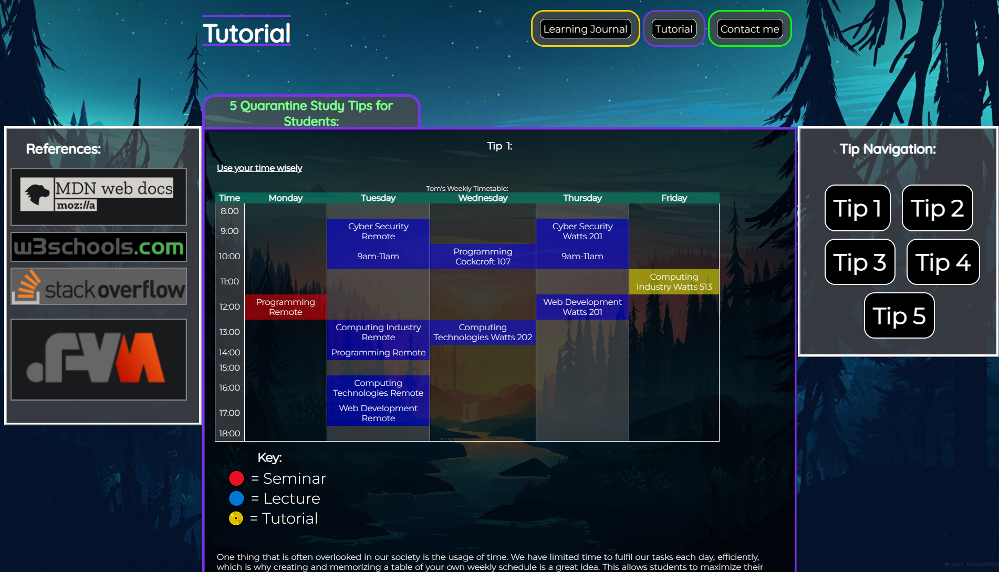
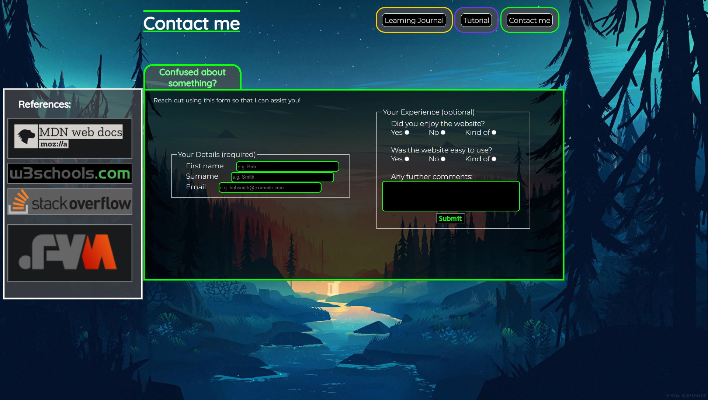

# CI435 - Responsive Website

In the first semester of my first year of university, I was given an assignment called "**Responsive Website**"for the module '**Introduction to Web Development**'. The task was
difficult as I did not have any previous experience when it came to coding websites until this point. However, I was still able to make a fairly nice-looking, semi-responsive
website. which outlines 10 weeks of learning various HTML and CSS fundamentals. This website contains the code & images that I used for my submssion, with some very minor tweaks
to make it appropriate for public access. I do plan on updating this README and the site itself, as I was unfortunately not skilled enough at the time to make the site fully
responsive.

<b>╭══• ೋ•✧๑♡๑✧•ೋ •══╮</b>

Score for this assignment: <b>62.5%</b>

<b>╰══• ೋ•✧๑♡๑✧•ೋ •══╯</b>

***(Plans to amend this soon)***
